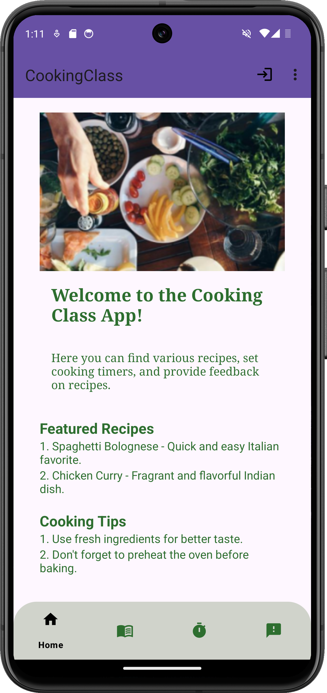
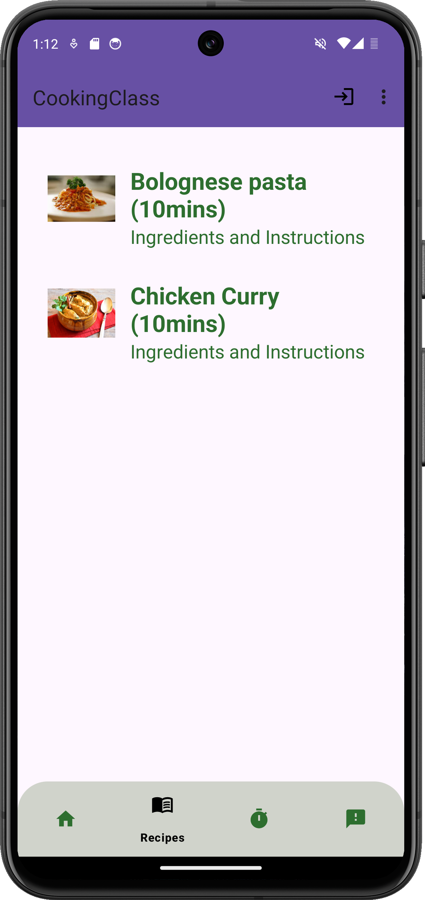
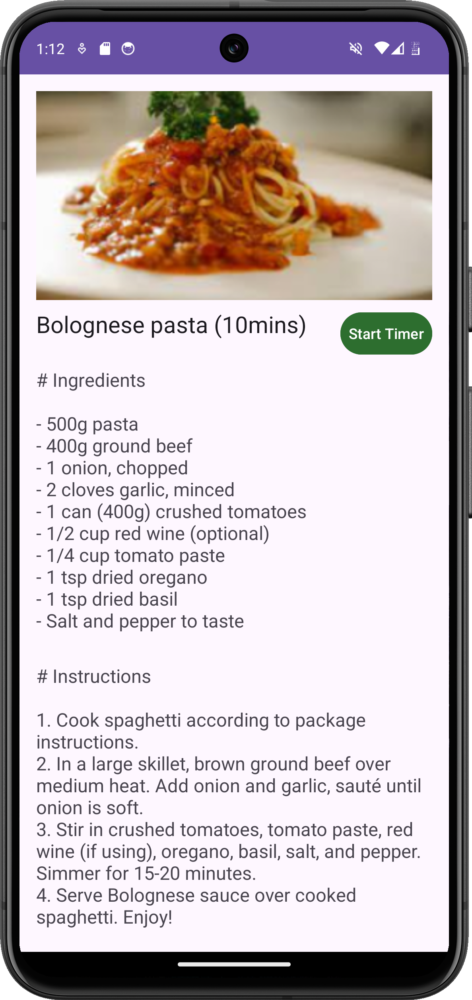
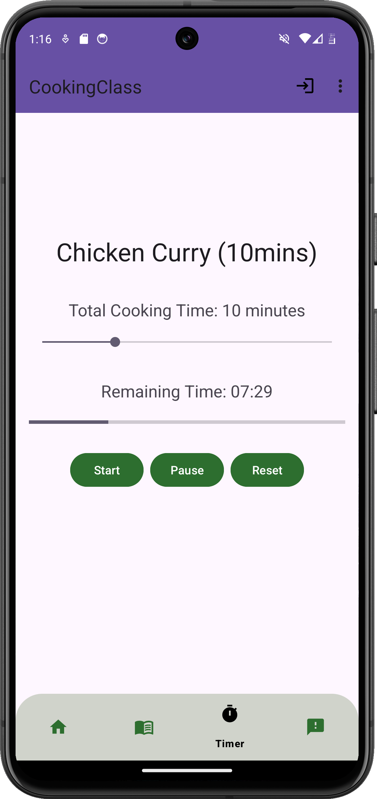
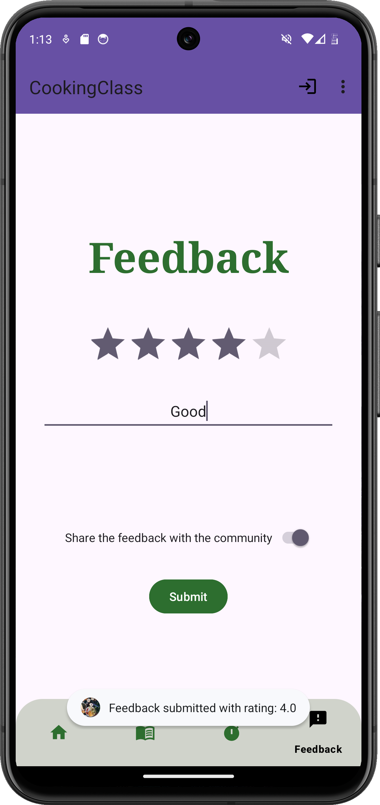

# Cooking Class

Explore the world of culinary delights with the Cooking Class App! Discover a variety of recipes, manage cooking timers, and share your culinary experiences effortlessly.

## Overview

The Cooking Class App is your go-to companion for everything related to cooking:
- Explore a vast library of recipes.
- Set precise cooking timers for each recipe stage.
- Rate recipes and provide valuable feedback.
- Enjoy seamless navigation with a BottomNavigationView.

## Key Features

### 1. Home Fragment

- Welcome users with appealing culinary images.
- Provide a warm welcome message and app usage instructions.
- Display featured recipes or cooking tips.

### 2. Recipes Fragment

    
    

- Browse through a comprehensive library of recipes.
- View recipe titles and dish thumbnails.
- Access detailed ingredients and cooking instructions for each recipe.
- Initiate cooking timers specific to each recipe.

### 3. Timer Fragment

- Adjust cooking timers with a user-friendly SeekBar.
- Start, pause, and reset timers effortlessly.
- Visualize countdown progress with a ProgressBar.

### 4. Feedback Fragment

- Rate recipes and provide reviews.
- Opt-in to share feedback with the cooking community.

## Tech Stack

- Programming Language: Java
- Development Tool: Android SDK
